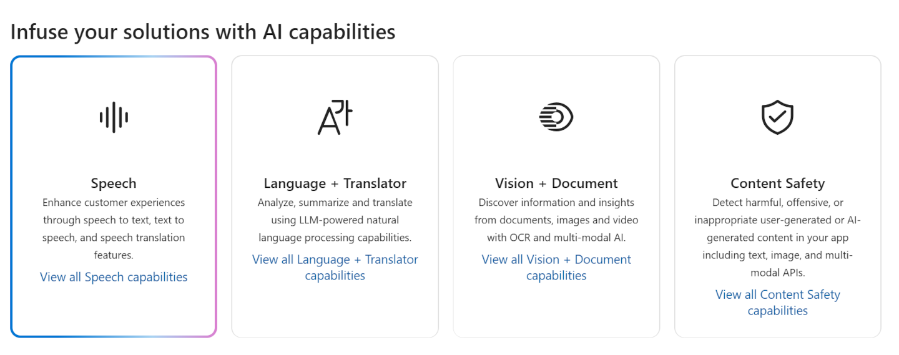

# Azure Language Studio

> Challenge created as part of the Microsoft AI Fundamentals Bootcamp by DIO, based on the tutorials:

- [Explore Speech in Azure AI Foundry portal](https://aka.ms/ai900-speech)
- [Analyze Text in Azure AI Foundry portal](https://aka.ms/ai900-text-analysis)

---

## 1. Explore Speech in Azure AI Foundry portal

### 1.1. Create a project in Azure AI Foundry portal

- Navigate to [Azure AI Froundry](https://ai.azure.com/).

- Create a project and new hub

- After the resources are created, you will be brought to your project’s Overview page. On the left-hand menu on the screen, select _AI Services_.

- On the _AI Services_ page, select the **Speech** tile to try out Azure AI Speech capabilities.

<div align="center">
     
</div>
<div align="center">Azure AI Services - Speech Tile</div>

### 1.2. Explore speech to text in Azure AI Foundry’s Speech Playground

- On the _Speech_ page, scroll down and select **Real-time transcription** under Try out Speech capabilities. You will be taken to the _Speech Playground_.

<div align="center">
     
</div>
<div align="center">Speech Playground Interface</div>

### 1.3. Input

- The audio used can be found in the folder <a href= './inputs'>inputs</a>.

<div align="center">

https://github.com/user-attachments/assets/e06da81b-a4c3-4f40-806f-81216462baea

</div>

<div align="center">Audio: What AI Can Do </div>

### 1.4. Output

Transcripted speech:

> AI enables us to build amazing software that can improve healthcare, enable people to overcome physical disadvantages, empower smart infrastructure, create incredible entertainment experiences, and even save the planet.

JSON attributes generated <a href= './output/speech-transcription-output.json'>here</a>.

## 2. Analyze text in Azure AI Foundry portal

### 2.1. Explore language capabilities in Azure AI Froundry's Language Playground

- Now let's explore the Azure AI Language.
- On the _Playgrounds page_, select the **Language playground** tile to try out some Azure AI Language capabilities.

<div align="center">
     
</div>
<div align="center">AI Services - Language Tile</div>

#### 2.1.1. Extract named entities with Azure AI Language in Azure AI Foundry portal

- Named entities are words that describe people, places, and objects with proper names.

In the _Language playground_, select Extract information. Then select the **Extract named entities** tile.

<div align="center">
     
</div>
<div align="center">Extract Named Entities Tile</div>

#### 2.1.2. Input

Below is the sample text that was used:

```
 Tired hotel with poor service
 The Royal Hotel, London, United Kingdom
 5/6/2018

 This is an old hotel (has been around since 1950's) and the room furnishings are average - becoming a bit old now and require changing. The internet didn't work and had to come to one of their office rooms to check in for my flight home. The website says it's close to the British Museum, but it's too far to walk.
```

#### 2.1.3. Output

**Extracted named entities:**

<div align="center">
     
</div>
<br />

More details <a href= './output/extracted-named-entities.txt'>here</a>.

JSON attributes generated <a href= './output/extract-named-entities-output.json'>here</a>.

### 2.2. Extract key phrases with Azure AI Language in Azure AI Foundry portal

- Key phrases are the most important pieces of information in text.

- In the _Language playground_, select **Extract information**. Then select the **Extract key phrases** tile.

<div align="center">
     
</div>
<div align="center">Extract Key Phrases Tile</div>

#### 2.2.1. Input

Below is the sample text that was used:

```
 Good Hotel and staff
 The Royal Hotel, London, UK
 3/2/2018

 Clean rooms, good service, great location near Buckingham Palace and Westminster Abbey, and so on. We thoroughly enjoyed our stay.

 The courtyard is very peaceful and we went to a restaurant which is part of the same group and is Indian ( West coast so plenty of fish) with a Michelin Star.

 We had the taster menu which was fabulous. The rooms were very well appointed with a kitchen, lounge, bedroom and enormous bathroom. Thoroughly recommended.
```

#### 2.2.2. Output

**Extracted key phrases:**

```
bedroom
Buckingham Palace
Clean rooms
courtyard
enormous bathroom
fish
Good Hotel
good service
great location
kitchen
London
lounge
Michelin Star
part
plenty
restaurant
same group
staff
stay
taster menu
The Royal Hotel
UK
West coast
Westminster Abbey
```

JSON attributes generated <a href= './output/extract-key-phrases-output.json'>here</a>.

### 2.3. Summarize text with Azure AI Language in Azure AI Foundry portal

- In the _Language playground_, select **Summarize Information**. Then select the **Summarize text** tile.

<div align="center">
     
</div>
<div align="center">Summarize Text Tile</div>

#### 2.3.1 Input

Below is the sample text that was used:

```
 Very noisy and rooms are tiny
 The Lombard Hotel, San Francisco, USA
 9/5/2018

 Hotel is located on Lombard street which is a very busy SIX lane street directly off the Golden Gate Bridge. Traffic from early morning until late at night especially on weekends. Noise would not be so bad if rooms were better insulated but they are not. Had to put cotton balls in my ears to be able to sleep--was too tired to enjoy the city the next day. Rooms are TINY.

 I picked the room because it had two queen size beds--but the room barely had space to fit them. With family of four in the room it was tight. With all that said, rooms are clean and they've made an effort to update them. The hotel is in Marina district with lots of good places to eat, within walking distance to Presidio. May be good hotel for young stay-up-late adults on a budget.
```

#### 2.3.2 Output

**Extractive Summary:**

- (Rank score: 78%) Very noisy and rooms are tiny
- (Rank score: 100%) The Lombard Hotel, San Francisco, USA
- (Rank score: 76%) Hotel is located on Lombard street which is a very busy SIX lane street directly off the Golden Gate Bridge.

**Abstractive Summary:**

- The reviewer experienced significant noise pollution and small room sizes during their stay at The Lombard Hotel in San Francisco, primarily due to its location on Lombard Street, a bustling six-lane thoroughfare near the Golden Gate Bridge.

- Despite the hotel'dedouble efforts to update rooms, the insulation was inadequate, necessitating the use of cotton balls to block out the noise for sleep. The chosen room, intended to accommodate two queen-sized beds for a standard stay, fell short in space, making it uncomfortably cramped for a family of four.

- However, the hotel was noted for its cleanliness and convenient location in the Marina District, which offers numerous dining options within walking distance. The overall tone suggests a mixed experience, potentially suitable for young adults seeking budget accommodations with late-night activities nearby, though the noise and space constraints were major drawbacks.

- The review highlights the need for better room insulation to enhance the guest experience.

JSON attributes generated <a href= './output/summarize-text-output.json'>here</a>.

### 2.4. Analyze sentiment with Azure AI Language in Azure AI Foundry portal

- Detect positive, negative and neutral sentiment in text.

- In the _Language playground_, select **Classify Text**. Then select the **Analyze sentiment** tile.

<div align="center">
     
</div>
<div align="center">Analyze Sentiment Tile</div>

#### 2.4.1. Input

Below is a sample text from a random Amazon review. The text is as follows:

```
I like Amazon but ????

I like Amazon, use it a lot, returns are really easy, my only grip is the next day delivery, I am a prime member and the day delivery gets here so late in the day its to late to do anything with it but make sure its all there.

Ordered yesterday and it said delivery about 1pm and every time that happens you check about 1pm and it says now between 16:30 and 19:30. it is not good enough it is always the same too late???
```

#### 2.4.2. Output

**Overall sentiment:**

<div align="center">
     
</div>
<br />

**Sentence analysis:**

<div align="center">
     
</div>
<br />

JSON attributes generated <a href= './output/analyze-sentiment-output.json'>here</a>.
